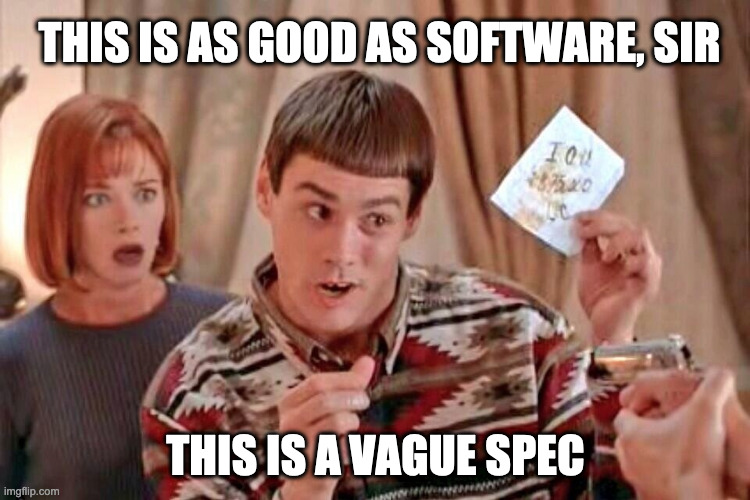

Este post es un pastiche de [uno anterior](https://facundoolano.wordpress.com/2016/12/09/this-is-unfortunate-and-were-stuck-with-it-forever/), de la época en que programaba cotidianamente en Node.js. Aquella vez empecé por citar [*Javascript: The Good Parts*](https://archive.org/details/javascriptgoodpa00croc_0/mode/2up) acerca de la necesidad de elegir un subconjunto para sacar lo mejor del lenguaje. En los años que siguieron a la publicación del libro de Crockford, JavaScript creció, se convirtió en un lenguaje diseñado "por comité", sumó mucha más funcionalidad (buena y mala) pero no retiró ninguna de las partes "feas", porque romper la compatibilidad es un lujo que JavaScript no puede darse. En fin, el problema original se acentuó: JavaScript es inconsistente y hace falta elegir un subconjunto de sus features para poder usarlo coherentemente, lo que se suele resolver en la práctica con linters.

Aquel post lo terminaba diciendo que yo tenía mi subset "preferido" y que, si pudiera romper la compatibilidad hacia atrás y hacer dos o tres pequeños cambios de sintaxis, podía incluso imaginar un nuevo lenguaje que, sin alejarse demasiado del original, se ajustara mejor a mis preferencias. Ahora quiero hacer el ejercicio borgeano de fingir que ese otro lenguaje existe y describirlo brevemente.

<div class="org-center">

<div id="org9448afd" class="figure">
<p>
</p>
</div>
</div>

El lenguaje se llama FunScript<sup><a id="fnr.1" class="footref" href="#fn.1" role="doc-backlink">1</a></sup> y, por comodidad, voy a tomar como base [ECMAScript 5](https://www.w3schools.com/js/js_versions.asp), es decir: JavaScript como lo conocíamos hasta el 2014, antes de que empezaran a "arreglarlo". La idea no es llegar a mi lenguaje ideal (que no tengo idea de cómo sería), sino ver cuánto se puede mejorar retirando elementos o reemplazándolos con alternativas más sencillas.


## Tijeras

Voy a empezar por recortar cosas con total impunidad y sin dar explicaciones:

-   Las sentencias no necesitan ser terminadas con `;`.
-   `NaN` y `Infinity` se van.
    -   En consecuencia, las divisiones por cero producen un error.
-   No hay más *type coercion*. Es decir que `1 + '2'` es un error.
    -   En consecuencia, `==` y `!=` funcionan como se espera y se puede prescindir de `===` y `!==`.
-   Los operadores booleanos C-like (`&&`, `||`, `!`) son reemplazados por sus equivalentes en inglés `and`, `or` y `not`.
-   `new` y `this` se van.
-   `null` se va, `undefined` se queda<sup><a id="fnr.2" class="footref" href="#fn.2" role="doc-backlink">2</a></sup>.

Nada muy lejos de las ideas de *The Good Parts* y [*The Better Parts*](https://es.slideshare.net/JSFestUA/js-fest-2018-douglas-crockford-the-better-parts). Ahora que terminé con la *higienización* inicial, pasemos a los cambios.


## Funciones

Las funciones se definen con la keyword `fun` en vez de `function` y devuelven la última expresión de su bloque<sup><a id="fnr.3" class="footref" href="#fn.3" role="doc-backlink">3</a></sup>:

```javascript
fun isEven(number) {
  number % 2 == 0
}
```

Admito que este cambio es un poco frívolo, pero tiene algunas ventajas: al ser más corta, la keyword `fun` resulta menos molesta de usar en una expresión, es decir: a nadie se le va a ocurrir la necesidad de introducir nueva sintaxis para las funciones anónimas:

```javascript
isOdd = fun (number) {
  not isEven(number)
}
```

Por otro lado, esta keyword nos da la excusa perfecta para nombrar al lenguaje *FunScript*. Por no mencionar que es de público conocimiento que leer la palabra `fun` con frecuencia libera endorfinas.

Si se quiere hacer un *early return*, se puede usar la keyword explícitamente:

```javascript
fun evenOrOdd (number) {
  if isEven(number) {
    return "even"
  }
  "odd"
}
```

Aunque, ya que estamos, el `if` es una expresión:

```javascript
fun evenOrOdd (number) {
  if isEven(number) {
    "even"
  } else {
    "odd"
  }
}

evenOrOdd(1) // "odd"
evenOrOdd(2) // "even"
```

De las versiones nuevas de JavaScript me voy a robar [rest](https://developer.mozilla.org/en-US/docs/Web/JavaScript/Reference/Functions/rest_parameters) y [default](https://developer.mozilla.org/en-US/docs/Web/JavaScript/Reference/Functions/Default_parameters) parameters:

```javascript
fun sum (...numbers) {
  numbers.reduce(fun (number, acc) {
    acc + number
  })
}

sum(1) // 1
sum (1, 2, 3) // 6

fun multiply (a, b=1) {
  a * b
}

multiply(3) // 3
multiply(3, 2) // 6
```

Pero, a cambio, elimino `arguments` y los llamados a funciones con un número de parámetros distinto al declarado producen un error:

```javascript
multiply(3, 3, 3) // TypeError: multiply() takes no arguments (1 given)
```


## Variables y scope

De Rust me voy a robar la idea de que los bindings son constantes a menos que se explicite lo contrario. Es decir que por default las asignaciones funcionan como `const` en ES6:

```javascript
age = 3
olderAge = age + 3
age = 10 // TypeError: Assignment to constant variable.
```

Para definir variables se usa la keyword `var`, aunque su comportamiento corresponde al de `let` en JavaScript, es decir tienen scope de bloque:

```javascript
var newAge = 3
newAge = 10 // 10

{
  newAge += 1 // 11
  var oldAge = 80
}

console.log(newAge) // 11
console.log(oldAge) // Uncaught ReferenceError: oldAge is not defined
```

Los bindings de los argumentos de las funciones son constantes:

```javascript
fun broken (arg) {
  arg += 1
}

var value = 5
broken(value) // TypeError: Assignment to constant variable.
```


## Arrays y loops

El `Array` es un equivalente inmutable al de JavaScript:

```javascript
a1 = [1, 2, 3]
a2 = a1.push(4)
a1 // [1, 2, 3]
a2 // [1, 2, 3, 4]
```

Se mantienen todas las funciones de alto orden: `map`, `reduce`, `forEach`, `filter` y `find`. Usando esas funciones se puede prescindir tranquilamente de la mayoría de los loops:

```javascript
var array = [1, 2, 3]

array = array.map(fun (i) {
  i + 1
}) // [2, 3, 4]

sum = array.reduce(fun (i, acc) {
  acc + i
}) // 9
```

Podemos usar `Array.range()` en lugar del `for` clásico de C:

```javascript
Array.range(5).forEach(fun (i) {
    console.log(i)
}) // 0 1 2 3 4
```

Podemos confiar en que los implementadores del lenguaje se van a ocupar de darnos *tail-call optimization*, así que también nos despedimos de `while` / `do while` y los reemplazamos con recursividad:

```javascript
fun getInput () {
  input = readline()
  if isValid(input) {
    input
  } else {
    getInput()
  }
}
```


## Objetos

Los objetos funcionan como mapas o diccionarios en otros lenguajes, con un poco de azúcar. A diferencia de JavaScript, las keys pueden ser de cualquier tipo, aunque si son strings se puede usar *dot notation* para acceder a ellas:

```javascript
obj = {
  value: 10,
  1: 11,
  []: 12
}

obj['value'] // 10
obj.value // 10
obj[1] //11
obj['1'] // undefined
```

Así como los bindings son constantes por default, los objetos asignados a constantes son inmutables, el equivalente a aplicar [Object.freeze](https://developer.mozilla.org/en-US/docs/Web/JavaScript/Reference/Global_Objects/Object/freeze) en JavaScript. Si el binding es variable, en cambio, se permite modificar las propiedades del objeto referido<sup><a id="fnr.4" class="footref" href="#fn.4" role="doc-backlink">4</a></sup>:

```javascript
obj = {}
obj = {value: 10} // TypeError: Cannot assign to read only property
obj.value = 10 // TypeError: Cannot assign to read only property
obj['another'] = 5 // TypeError: Cannot assign to read only property

var obj2 = {}
obj2 = {value: 10}
obj2.another = 5
console.log(obj2) // {value: 10, another: 5}
```

Como con otros valores, las objetos recibidos como argumentos de funciones son constantes:

```javascript
fun irrespective (obj) {
  obj.value = 10 // TypeError: Cannot assign to read only property
}
```

No existe `this` ni `prototype`, ni mucho menos clases. Pero el objeto puede tener métodos seteando funciones a sus propiedades, y con closures se puede mantener estado interno:

```javascript
fun Counter () {
  var value = 0
  {
    inc: fun () { value += 1 },
    dec: fun () { value -= 1 },
    value: fun () { value }
  }
}

c = Counter()
c.value() // 0
c.inc() // 1
c.inc() // 2
c.dec() // 1
```

Fin.

<section class="footnotes" markdown=1>
## Notas

<sup><a id="fn.1" class="footnum" href="#fnr.1">1</a></sup> Para este ejercicio podemos ignorar alegremente el hecho de que [ya existe un lenguaje con ese nombre](https://github.com/ZachBray/FunScript).

<sup><a id="fn.2" class="footnum" href="#fnr.2">2</a></sup> Sé que hay cierto consenso en que permitir valores indefinidos en un lenguaje trae consecuencias indeseables pero, para ser sincero, es una discusión sobre la que no me interioricé, así que simplemente voy a reincidir en el error de la mayoría de los lenguajes que conozco.

<sup><a id="fn.3" class="footnum" href="#fnr.3">3</a></sup> En estos ejemplos uso `isEven` y `isOdd` a modo ilustrativo. Desde luego que en un proyecto real, como FunScript es completamente interoperable con JavaScript, aprovecharía los paquetes [is-even](https://www.npmjs.com/package/is-even) y [is-odd](https://www.npmjs.com/package/is-odd) en vez de reinventar la rueda.

<sup><a id="fn.4" class="footnum" href="#fnr.4">4</a></sup> Admito que esto es bastante inchequeable y no estoy seguro de que cierre por todos lados.

</section>