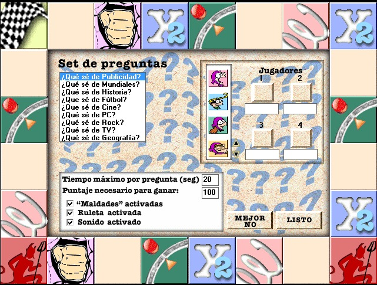
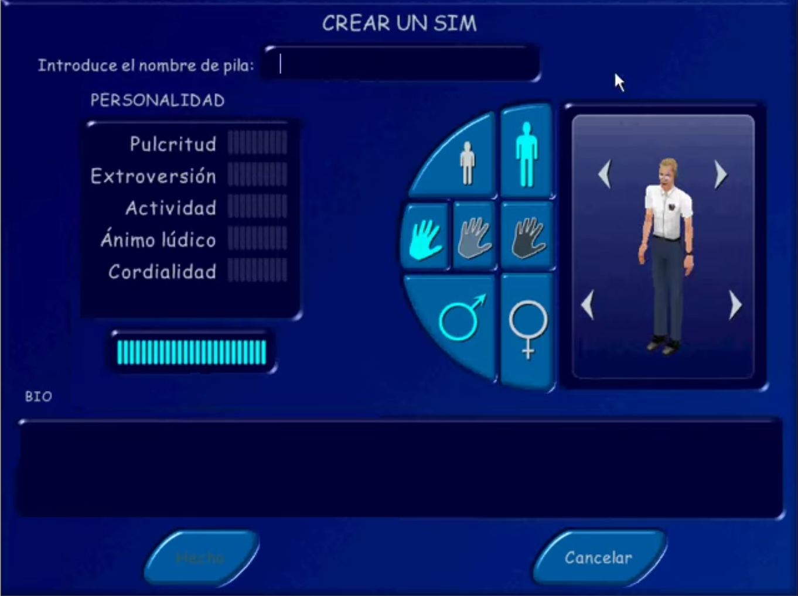
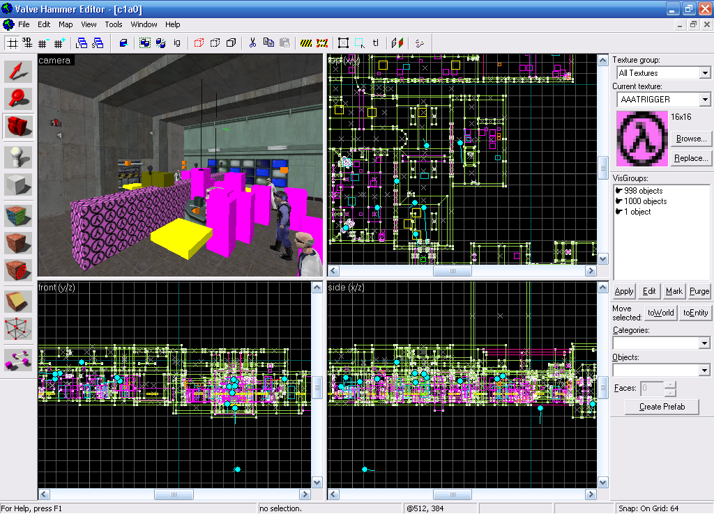

En el principio fue la oscuridad de la sala de Computación, los escritorios húmedos, dos o tres alumnos apiñados contra cada teclado, las sucesiones interminables de ejercicios de Word o de Excel. A veces terminábamos temprano o nos daban hora libre y entonces podíamos disponer de las computadoras, usarlas como lo que eran: rebuscadas consolas de videojuegos. El problema es que la oferta, además de escasa, era siempre "educacional". Me acuerdo, por ejemplo, de dos juegos de preguntas y respuestas: *El laberinto del saber*,
una especie de *rogue-like* en el que las puertas se abrían respondiendo preguntas<a id="fnr.1" class="footref" href="#fn.1" role="doc-backlink">1</a>, y el *Qué se yo*, un juego de mesa aproximadamente computarizado.

Lo interesante de esos juegos era que, revisando un poco los directorios donde estaban instalados, era fácil darse cuenta de que el contenido era editable, es decir, que podías insertar tus propias preguntas y respuestas. Entonces, en lugar de pasarnos la hora de Informática moviendo un personaje por la pantalla, respondiendo preguntas genéricas de Historia o Geografía, aprovechábamos el tiempo para inventar trivias delirantes sobre nuestros compañeros y el día a día en el Colegio. Así fue como aprendí que crear —o, en este caso, modificar— videojuegos puede ser mucho más divertido que jugarlos.

Quizás sea un impulso natural del autor el tratar de introducirse como personaje en sus obras. Lo había visto en el manga de *Dragon Ball*, donde Toriyama aparecía disfrazado de robot, y lo imitaba en mis propias historietas. Lo vi en videojuegos donde la combinación apropiada de teclas revelaba un mensaje, una foto, o incluso te permitía jugar como alguno de los programadores; pienso en los primeros *Mortal Kombat*, en *NBA Jam*, en *Robocop vs Terminator*. Evidentemente la posibilidad de personalizar los videojuegos —muy precursora a la de diseñar uno desde cero— vino desde el principio unida al proyecto de meterme a mí y a mis amigos como personajes.

A mediados del 2000 hubo una "fiebre" del *Sims*. Yo lo compré sin saber de qué se trataba, confiando en que Maxis ofrecería algo a la altura del *SimCity*. Obviamente me volví adicto inmediatamente, pero lo novedoso fue que no era el único: parecía que todas las personas de mi edad lo estaban jugando, incluso gente que no solía interesarse por los videojuegos o que ni siquiera tenían una computadora en su casa. Esta especie de casa de muñecas digital te enganchaba en muchos niveles: podías jugar a "ganarte la vida" (estudiar, trabajar, hacer amistades, levantarte a la vecina), dedicarte a hacer shopping, pasarte horas en modo arquitecto o hasta armar sofisticados dispositivos de tortura: matar de hambre a los Sims, prenderlos fuego u obligarlos a dormir en su propio meo.

En este caso no hacía falta mucha inventiva para introducirte como personaje: el juego estaba diseñado para eso. Una vez agotada la mecánica básica, el siguiente paso fue crearnos a mis amigos y a mí, y ponernos a vivir en la mansión ideal, construida a fuerza de *klapaucius*<a id="fnr.2" class="footref" href="#fn.2" role="doc-backlink">2</a>. Con el rudimentario acceso a internet del que disponíamos, empezamos a descargar contenido no oficial, lo traficábamos en diskettes: nuevos electrodomésticos, nueva ropa, *skins* de personajes famosos para condimentar el barrio.
Yo desempolvé mis habilidades con el Paint para modificar las texturas y obtener  representaciones más fieles de mis amigos.
En esta última etapa resurgió la contradicción: después de pasar horas construyendo casas y creando personajes, instalando expansiones y toda clase de basura descargada de internet, *jugar* al Sims terminó haciéndose aburrido.

La creación de "avatars" se volvió un estándar: ya venía integrada en los videojuegos y no implicaba ningún desafío creativo, pero la experiencia con el *Sims* me dejó predispuesto a recurrir a internet en busca de opciones más sofisticadas para modificar los juegos que me interesaban.

La práctica de insertarnos en los juegos terminó de salirse de control con el *Winning Eleven*. Durante largos años mis juntadas con amigos giraron alrededor de este juego de PlayStation, que le sacaba años luz de ventaja a los FIFA de la computadora. El *Winning* tenía funcionalidad para agregar nuevos jugadores y a alguien de mi grupo se le ocurrió la idea de ponernos a todos en el juego. Claro que, como después íbamos a usar a esos jugadores para competir entre nosotros, teníamos que llegar a cierto consenso sobre cómo les asignábamos habilidades, tenía que haber cierta relación con nuestras habilidades en el "mundo real". Es decir que, para recibir un 19 de *shoot power* —el máximo en esa misteriosa escala 12-19 que manejaba el juego—, había que demostrar que eras el que más fuerte le pegaba a la pelota entre nuestros conocidos<a id="fnr.3" class="footref" href="#fn.3" role="doc-backlink">3</a>. Esto derivó no solamente en eternos debates durante los recreos, borradores sobre borradores de borradores de "los skills", sino en discusiones durante los partidos en la plaza y hasta carreras en plena calle para comparar velocidad y aceleración entre dos jugadores.

La siguiente "ola" fue la de los juegos en red. Para uno de sus cumpleaños, un amigo nos citó en un lugar que hoy llamaríamos *cyber* pero que no se parecía nada a los locutorios glorificados donde nos dábamos nuestra dosis semanal de internet en la época del *dial-up.* Nos metieron en una sala de espera, le entregaron a cada uno un *head set* y, cuando llegó nuestro turno, nos condujeron por un galpón oscuro donde reverberaban disparos y explosiones. Me sentaron frente a una computadora en la que procedí a ser asesinado repetidamente por los jugadores vecinos y a hacer tiempo entre partido y partido, hasta que se terminó la hora. La experiencia, en su conjunto efímero y frustrante, me hizo acordar al *LaserShots* que se había puesto de moda unos años antes.

Así y todo, el juego en cuestión, el *Counter-Strike*, resultaba fascinante desde el punto de vista técnico, especialmente porque yo les había perdido el rastro a los *First-Person Shooters* después del *Doom*. Y si bien nunca llegué a participar activamente en el mundo de los juegos en red, sí me hice de una copia del *Counter-Strike* y busqué en internet un paquete de *bots* para adaptar la experiencia a algo más cercano a mis hábitos: poder jugar sin conexión, contra la computadora.

En el *Counter-Strike*, con la excepción del arma, el protagonista era invisible y apenas si te cruzabas a los otros jugadores por unos instantes: la estrella indiscutible eran los escenarios. ¿Cómo olvidar ese pueblito italiano o aquel sitio arqueológico azteca? Y los escenarios eran también la manera por excelencia de expandir y personalizar el juego. Así que si quería "meter mano" en el *Counter-Strike*, tenía que ser editando mapas. Afortunadamente para mí, la empresa que desarrollaba el motor del juego distribuía también un software con aquel fin, el *Valve Hammer Editor*. Si bien el editor era amigable, se trataba de mi primer contacto directo con modelos 3D<a id="fnr.4" class="footref" href="#fn.4" role="doc-backlink">4</a>, un material mucho más complejo que los píxeles del *Paint* a los que estaba acostumbrado. La tarea me hacía acordar al diseño con *AutoCAD* que le veía hacer a mi viejo en su trabajo de arquitecto: había que construir edificios y comunicarlos, buscar las texturas más adecuadas para cada ambiente, considerar cómo los espacios resultantes se prestarían al desenvolvimiento del juego.

Y así como en oportunidades anteriores nos había imaginado a mis compañeros y a mí como personajes, a la hora de diseñar escenarios me dediqué a representar los espacios que me eran familiares: mi casa y el colegio. Pasé semanas enteras trabajando en esos archivos que no tenía idea de cómo distribuir, que probablemente nunca llegarían a ejecutarse fuera de mi computadora y que, incluso para mí, terminarían por funcionar mejor como maquetas interactivas que como escenarios entretenidos para el juego. El mapa de mi casa incluía un tramo de la calle, la puerta de entrada y el garage que ingresaban al jardín, el largo pasillo lateral que conducía a la casa de mi nonna y conectaba con el patio trasero, mi cuarto, las escaleras a la terraza y un delirante sistema de alcantarillas de mi cosecha, donde habría que desactivar las bombas<a id="fnr.5" class="footref" href="#fn.5" role="doc-backlink">5</a>. Me hubiera venido bien un plano o aunque sea un metro para sacar bien las proporciones; el proyecto de modelar el colegio era mucho más ambicioso y nunca llegué a pasar de los primeros esbozos.

A esta altura supongo que ya era evidente que, más que pasarme horas forzando los límites de juegos que no tenía demasiado interés en jugar, lo que yo quería en realidad era diseñar mis propios juegos, mundos propios con reglas propias, y aunque ni siquiera llegara a entender que para eso era necesaria alguna forma de programación, seguramente internet, o ese otro Aleph llamado *Parque Rivadavia*, tendrían algo para ofrecerme.

<section class="footnotes" markdown=1>
## Notas
<!--- 
# Notas al pie de p&aacute;gina

 -->
<a id="fn.1" href="#fnr.1">1</a> Que ahora me vengo a enterar que [es un juego cubano](https://cachivachemedia.com/laberinto-del-saber-escapad-de-la-ignorancia-a8e969f97eb4). Podría dedicar unos cuántos párrafos a especular sobre cómo viajó ese juego desde el Caribe socialista hasta un colegio del conurbano bonaerense.

<a id="fn.2" href="#fnr.2">2</a> Código para obtener dinero en el *Sims*.

<a id="fn.3" href="#fnr.3">3</a> Yo, que era igualmente mediocre jugando al fútbol y a la PlayStation, apenas rasqué un 18 en pase y un 17 en técnica.

<a id="fn.4" href="#fnr.4">4</a> Y el único hasta la fecha, si omito algunos escarceos improductivos con el *3D Studio Max*.

<a id="fn.5" href="#fnr.5">5</a> Me hubiera gustado ilustrar este post con algunas capturas de ese escenario, pero los backups de esa época, si no terminaron en la basura, están perdidos en algún cajón de la casa paterna, esa misma que el mapa representa.

</section>
