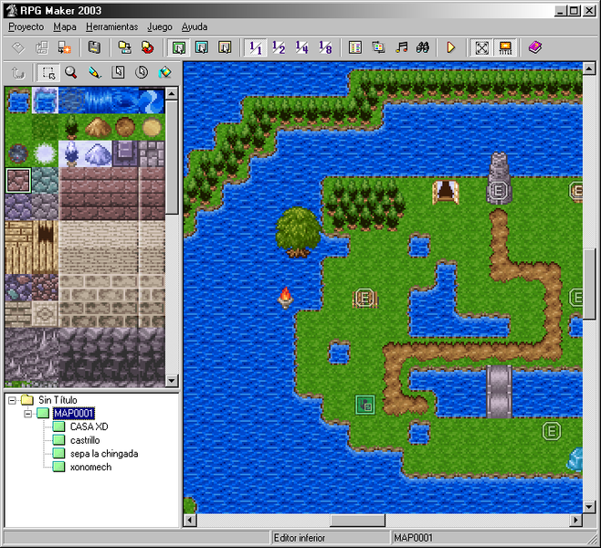
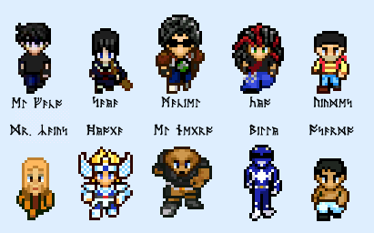
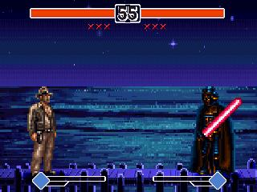
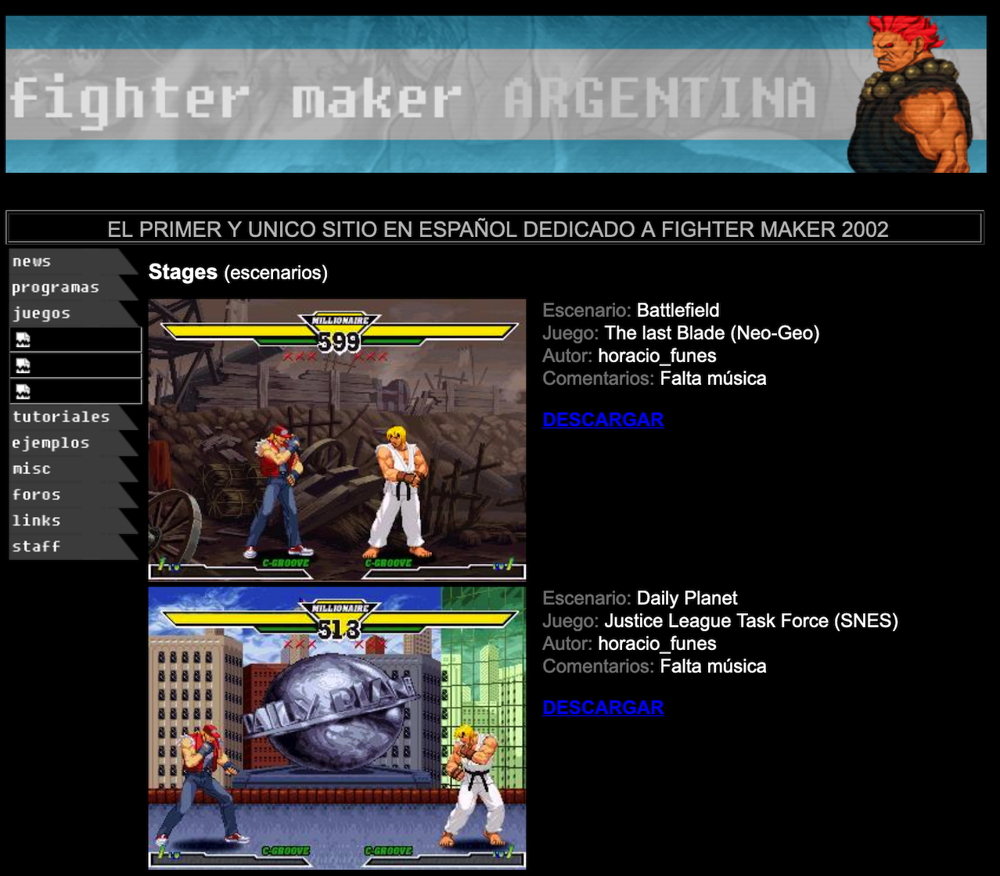

Agotado mi [interés en el modding](../2020-09-29-memoria-videojueguistica), estaba claro que lo que yo quería era diseñar mis propios
videojuegos. Pero, ¿cómo se hace un videojuego? No era una pregunta fácil de formularle a Google
en el 2003. La respuesta, o en todo caso la siguiente pieza del rompecabezas, me la dio Maciel, mi mejor amigo de la secundaria. Así como yo era un *hardcore* de las aventuras gráficas —probablemente el único género para el que llegué a desarrollar cierta habilidad—, Maciel se especializaba en los juegos de rol, los [JRPG](https://en.wikipedia.org/wiki/History_of_Eastern_role-playing_video_games#Japanese_role-playing_games) como el *Final Fantasy*. Este tipo de juegos siguen un patrón muy específico, casi un estándar, por lo que la pregunta
*¿Cómo se hace un RPG?* resultaba mucho más concreta, mucho más fácil de responder que la infinitamente abierta
*¿Cómo se hace un videojuego?* En teoría, el diseñador de un JRPG debería proveer unos personajes,
una serie de escenarios sembrados de enemigos, un poco de configuración y unirlo todo con ese pegamento que llaman *historia*;
en teoría, uno debería poder meter todo eso en la máquina de hacer RPGs y obtener un videojuego. La máquina de hacer RPGs, me dijo Maciel en el 2003, es el [RPG Maker](https://en.wikipedia.org/wiki/RPG_Maker).

Ahí lo tenía, con una herramienta no muy distinta al editor de escenarios que había usado para el *Counter-Strike*, podía armar mis propios videojuegos. El hecho de que fueran de un género específico, un género que yo no había frecuentado<a id="fnr.1" class="footref" href="#fn.1" role="doc-backlink">1</a>, era un detalle mínimo.
El RPG Maker me daba la estructura, el motor, los menúes; los mismos sitios que lo distribuían ilegalmente estaban llenos de ejemplos, tutoriales y gráficos, toda una comunidad dispuesta a ayudarme. Yo apenas tenía que encargarme de completar los espacios en blanco, inventarme una historia, diseñar algunos mapas&#x2026;

El objetivo era lograr algo meramente ejecutable, no tenía que ser un *buen* juego, ni original, ni siquiera coherente; al menos no por el momento. Así que recurrí a las herramientas de siempre: ¿Personajes? Mis amigos y yo, para empezar, y para completar lo que pudiera sacar de la ficción. En cuanto a los escenarios, ya no me iba a alcanzar con mi casa y el colegio como cuando hacía mapas para el *Counter-Strike*; para hacer un RPG tenía que ampliar las dimensiones, ponerle algo de épica, así que pensé en mi Ciudadela natal y sus localidades aledañas: Ramos, Liniers, Villa Luro, todas estaciones del Sarmiento, que era lo que conocía. Y por extensión el tren terminó entrando también en el juego<a id="fnr.2" class="footref" href="#fn.2" role="doc-backlink">2</a>. En el apogeo de mi fanatismo por *El Señor de los Anillos*, imaginé una travesía hasta Ezeiza, que sonaba como un destino aceptable, suficientemente lejano y boscoso. El juego sería, entonces, *El Viaje a Ezeiza*.

Claro que mi ignorancia en el diseño de software iba más allá de no saber programar; no conocía el "divide y vencerás", el trabajo iterativo, el *Minimum Viable Product*. En consecuencia, me dedicaba a hacer todo, todo el tiempo, sin concretar nada; guiado por la curiosidad o por el antojo, saltaba de una tarea a la siguiente: armar los mapas, conectarlos, programar a los enemigos, insertar diálogos, personalizar los menúes, negociar la participación de mis amgios en la historia y el look de sus *sprites,* que después procedía a dibujar en el Paint. Desde luego que nunca terminé de armar algo usable, pero la experiencia me sirvió para incorporar los primeros rudimentos de pensamiento algorítmico.

Con la misma lógica "hedonista" con la que organizaba mi trabajo, empecé a probar otros de los *game makers* que encontraba en internet. Específicamente, me llamó la atención uno para hacer juegos de pelea estilo *Street Fighter*: el *2D Fighter Maker*. El de lucha era un género todavía más estructurado y mecánico que el de los RPGs: la historia era innecesaria, los diálogos inexistentes, los escenarios sencillos; casi todo el trabajo consistía en insertar los gráficos de los personajes y programar sus movimientos. Y aunque yo no tocaba uno de esos juegos desde que el *Mortal Kombat* se había pasado al 3D, el descubrimiento de este editor activó los resortes de mi nostalgia<a id="fnr.3" class="footref" href="#fn.3" role="doc-backlink">3</a>. Esta vez sí tenía una idea concreta sobre el juego que quería hacer.

Una década antes había recibido mi primer consola, un [Family Game](https://es.wikipedia.org/wiki/Family_game), aquel clon de la Famicom de Nintendo. Tan pirata como la consola eran algunos de los juegos que pasaban por nuestras manos, y hubo uno que se me grabó en la memoria sino por la calidad de la implementación, por la osadía del concepto. Los autores de este juego de pelea, de equívoco nombre [World Heroes 2](https://bootleggames.fandom.com/wiki/World_Heroes_2), parecían haberse propuesto violar tantas licencias como cupieran en un cartucho de 8 bits. En la nómina alternaban personajes de *Street Fighter* y  *Fatal Fury* con Mario, Sonic, Gokú y Leonardo, la tortuga ninja. Cuando encontré el 2D Fighter Maker pensé inmediatamente en aquel *World Heroes 2* y proyecté *la exageración de esa posibilidad*: combinar personajes arbitrarios de todas las franquicias en un único juego; una especie de *Super Smash Bros* desmesurado, libre de las ataduras de la propiedad intelectual. El *World Heroes Millenium*.

Aún con el alcance reducido de los juegos de pelea, no hace falta mucha imaginación para darse cuenta de cómo semejante proyecto estaba destinado a salirse de control, crecer y crecer, todo el tiempo sumando nuevos personajes. El único limitante era encontrar fuentes para los *sprites*, es decir, juegos emulables en computadora de los que extraer los gráficos. El proyecto nunca estuvo cerca de terminarse<a id="fnr.4" class="footref" href="#fn.4" role="doc-backlink">4</a>, pero sí hubo muchas versiones alfa que mis compañeros venían a probar a la salida del colegio. Esos prototipos tenían mucho potencial humorístico: cantidades excesivas de personajes coexistían erráticamente en escena, controladas por inteligencias a medio cocinar; unos muy pulidos Ryu y Ken peleaban contra Goros indistinguibles que se la pasaban dando saltos; un *Mecha-Godzilla* de un único golpe se las veía con un *Darth Vader* pixelado que se limitaba a flotar por la pantalla.

El proceso, además, tuvo ciertos efectos colaterales interesantes. El *2D Fighter Maker* era un software de nicho, producido en Japón y traducido ilegalmente al inglés por un puñado de nerds; los recursos eran mucho más escasos que los del *RPG Maker* y para conseguir ayuda tuve que acostumbrarme a participar en foros en inglés y chatear con gente de otras zonas horarias. A medida que ganaba dominio del editor, empecé a "devolverle a la comunidad": publiqué tutoriales, contribuí personajes a juegos colectivos y hasta me despaché con [un sitio web](https://web.archive.org/web/20050418192430/http://fightermaker.fateback.com/) armado en *Microsoft FrontPage*, "El primer y único sitio en español dedicado a Fighter Maker 2002" (sic).

Como todos los proyectos que lo precedieron, el *World Heroes Millenium* me ganó por cansancio. Después de casi un año, tuve que admitir que el esfuerzo no valía la pena: aunque la idea de juntar a todos esos personajes sonara divertida, la verdad era que no me gustaban mucho los juegos de pelea; no tenía sentido dedicar tanto tiempo a construir algo que no me entusiasmaba. Ya que era fanático de las aventuras gráficas, parecía más razonable intentar con ese tipo de juegos. Así que me puse a buscar un *Maker* de aventuras gráficas y encontré el [Adventure Game Studio](https://en.wikipedia.org/wiki/Adventure_Game_Studio).

El problema es que el de las aventuras es, entre todos los géneros, el más difícil de implementar: no se puede ir muy lejos con gráficos "prestados", la historia no es un accesorio sino el corazón del proyecto, hace falta escribir buenos diálogos y el diseño de puzzles es una disciplina que requiere cierta maestría. Si los "juguetes" de rol y pelea me habían desbordado, ¿cómo esperaba afrontar algo que se parecía más a una película que a un juego? En cualquier caso, no tuve oportunidad de demorarme con esta pregunta; al poco tiempo vinieron la facultad y el trabajo, y durante casi una década se acabó el tiempo para los *side-projects*.

<section class="footnotes" markdown=1>
## Notas
<!--- 
# Notas al pie de p&aacute;gina

 -->
<a id="fn.1" href="#fnr.1">1</a> Con la notable excepción de los juegos de *Pokémon* para Game Boy, en lo que debe haber sido mi primer contacto con los emuladores en la PC. Aquel año hice un curso acelerado para informar mis actividades: terminé el *Breath of Fire*, varios *Final Fantasy*, el *Vagrant Story*.

<a id="fn.2" href="#fnr.2">2</a> En retrospectiva, esto parece bastante original; a lo largo de los años me crucé con RPGs que apelan a autos, barcos (con la variante *steampunk* de los buques voladores), pájaros, caballos (o [chocobos](https://en.wikipedia.org/wiki/Chocobo)), bicicletas, pero no debe haber muchos que usen el tren como medio de transporte entre ciudades.

<a id="fn.3" href="#fnr.3">3</a> Sí, señora, yo ya era un nostálgico a los quince años.

<a id="fn.4" href="#fnr.4">4</a> Si hubiera sido solo un poco más pragmático (o, mejor dicho, si mi prioridad hubiera sido *terminar* el proyecto) habría usado otro engine, el [MUGEN](https://en.wikipedia.org/wiki/Mugen_(engine)), gratuito y mucho más popular. Probablemente hubiera podido implementar el 90% de mi juego reusando contenido producido por la comunidad, lo que obviamente le habría sacado toda la diversión.

</section>
