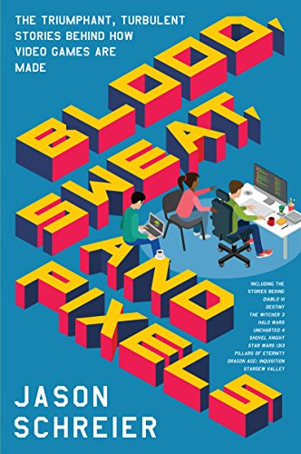
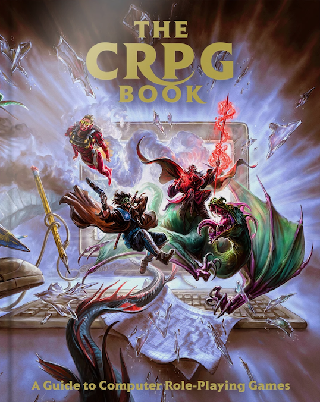

Uno de los vicios que cultivé durante *las cuarentenas*<a id="fnr.1" class="footref" href="#fn.1" role="doc-backlink">1</a> es el de acumular y ocasionalmente leer libros sobre videojuegos.
A continuación, un compendio.

[Ya escribí](../2020-08-28-maestros-de-la-fatalidad) de [*Masters of Doom*](https://www.goodreads.com/book/show/222146.Masters_of_Doom), el libro sobre id Software con el que me introduje al género y que me sirvió de excusa para empezar este blog. Se lee como novela y se las arregla milagrosamente para transmitir el mérito del trabajo de Carmack y compañía sin entrar en detalles técnicos. Para los programadores a los que nos interesan esos detalles, están los [libros negros](https://fabiensanglard.net/gebb/index.html), en los que Fabien Slangard analiza el código y explica cómo funcionan los motores del *Wolfenstein* y el *Doom<a id="fnr.2" class="footref" href="#fn.2" role="doc-backlink">2</a>.*

 

Siguiendo la línea de lectura liviana del *Masters of Doom* está [*Blood, sweat and pixels*](https://www.goodreads.com/book/show/33640770-blood-sweat-and-pixels). Elaborado a partir de una serie de entrevistas, cada capítulo relata el proceso de desarrollo de un videojuego contemporáneo (todos post 2000) para justificar el leitmotiv del libro: *terminar de producir cualquier juego es un milagro*. Por un tiempo me resistí a leerlo por no conocer casi ninguno de los juegos que trata pero me alcanzaron un par de capítulos para darme cuenta del error: primero, porque todos los casos se relacionan de una u otra manera con los clásicos<a id="fnr.3" class="footref" href="#fn.3" role="doc-backlink">3</a> y, sobre todo, porque el interés del libro pasa por el desarrollo de software más que por la nostalgia retro.

Para un tratamiento relativamente riguroso de la historia de los videojuegos está [*Replay*](https://www.goodreads.com/book/show/8343159-replay), de Tristan Donovan. El libro es largo y abarca mucho territorio con el mérito de mantenerse entretenido<a id="fnr.4" class="footref" href="#fn.4" role="doc-backlink">4</a>; ofrece un marco de referencia sobre la evolución de la industria y la tecnología que la sostiene<a id="fnr.5" class="footref" href="#fn.5" role="doc-backlink">5</a> pero desde ya que no profundiza demasiado en los juegos que menciona. Para eso está [The Digital Antiquarian](https://www.filfre.net/), un blog que hace más de diez años viene desgranando los videojuegos de computadora más relevantes junto con el contexto tecnológico y cultural que los rodeó, y que convenientemente ofrece [volúmenes anuales](https://www.filfre.net/the-digital-antiquarian-e-book-library/) en formato digital (al momento en que escribo va por el '95).

 

Las ediciones de lujo de [Bitmap Books](https://www.bitmapbooks.co.uk/) se enfocan más en el arte de los juegos, con libros que examinan un género o plataforma en particular. De los que me interesan, [*The Art of Point-and-Click Adventure Games*](https://www.goodreads.com/book/show/39931621-the-art-of-point-and-click-adventure-games) intercala capturas de casi todos los juegos relevantes del género con entrevistas a sus creadores, y [*The CRPG Book*](https://www.goodreads.com/book/show/25721224-the-crpg-book-project) se organiza como una enciclopedia que incluye marco histórico, reseñas, rankings e instrucciones para jugar en computadoras modernas (hay [versión gratuita en pdf](https://crpgbook.wordpress.com/)).

Más *indie* y accesibles, pero también más desparejos, son los libritos de [Boss Fight Books](https://bossfightbooks.com/). De los tres que leí el que más me gustó es uno sobre el [*NBA Jam*](https://www.goodreads.com/book/show/36597600-nba-jam): escrito a imagen y semejanza del *Masters of Doom*, complementa la historia del juego con la evolución de los "fichines", desde el pinball a los arcades y el posterior declive con la masificación de las consolas, y cuenta cómo Midway &#x2014;que por la misma época produjo
también los *Mortal Kombat*&#x2014; chocó la calesita.

<section class="footnotes" markdown=1>
## Notas
<!--- 
# Notas al pie de p&aacute;gina

 -->
<a id="fn.1" href="#fnr.1">1</a> Sí, pretendo usar la pandemia como excusa de todas mis desviaciones hasta el final de los días.

<a id="fn.2" href="#fnr.2">2</a> Después de leer el primero, en un derrape kamikaze hice el [intento fallido](https://github.com/facundoolano/wolf4py) de portar el Wolf3D a Python.

<a id="fn.3" href="#fnr.3">3</a> Por ejemplo: *Pillars of Eternity* es descendiente directo de *Baldur's Gate* y de la [famosa campaña de Kickstarter](https://www.youtube.com/playlist?list=PLIhLvue17Sd7F6pU2ByRRb0igiI-WKk3D) de *Double Fine*; *Halo Wars* es la obra despedida del estudio que desarrolló los *Age of Empires*; etc.

<a id="fn.4" href="#fnr.4">4</a> A juzgar por el único capítulo que leí.

<a id="fn.5" href="#fnr.5">5</a> Los libros [*Hackers*](https://www.goodreads.com/book/show/56829.Hackers) e [*The Innovators*](https://www.goodreads.com/book/show/21856367-the-innovators) ejecutan una tarea parecida con la industria del software en general, ocupándose ocasionalmente de los videojuegos.

</section>
