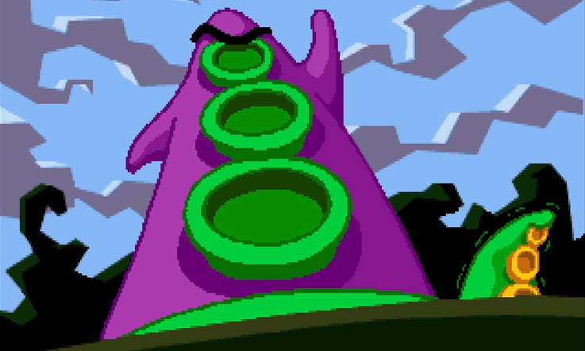
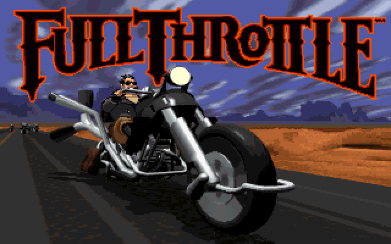
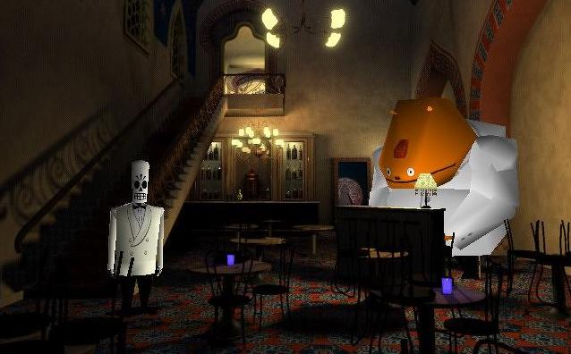
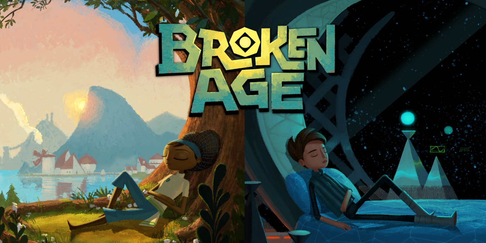
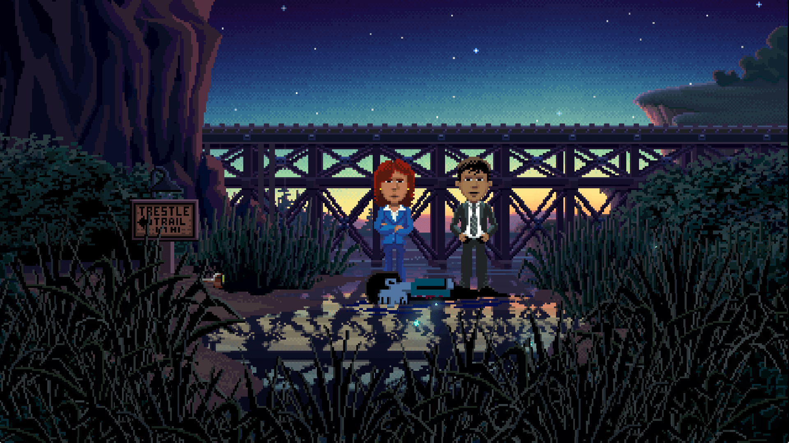
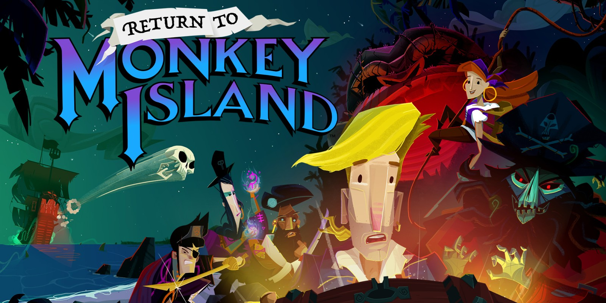

Esta es la segunda parte de una serie de dos.[ *Leer la primera parte*.](../2022-08-09-llegando-los-monos/)

## 6. Día del Tentáculo

 

Tras la salida de Ron Gilbert, sus colaboradores en las dos entregas de *Monkey Island* tomaron la posta en LucasArts. Tim Schafer y Dave Grossman diseñaron en conjunto *Day of the Tentacle*, el primer hit de la era post-Gilbert, una aventura de viajes en el tiempo que funciona como secuela "light" de *Maniac Mansion*. El jugador controla simultáneamente a tres personajes, cada uno situado en un siglo diferente en la casona del juego anterior. Más allá de ser la primera aventura *talkie* y de incorporar la dimensión temporal a la resolución de puzzles<a id="fnr.1" class="footref" href="#fn.1" role="doc-backlink">1</a>, *Day of the Tentacle* se destacó menos por sus innovaciones que por culminar el estilo iniciado en *Monkey Island*: los gráficos pixel art, el humor, el diseño de puzzles centrado en el inventario, son todos elementos en los que compite para el mejor de la historia. *DoTT* a la vez perfeccionó y agotó aquel modelo: mientras los estudios menores siguieron publicando combinaciones lineales de *Monkey Island*, LucasArts intentó innovar con cada una de las aventuras que sucedieron a *Day of the Tentacle*.

Afuera de LucasArts, el género tomó proporciones insólitas. En línea con el espíritu de época<a id="fnr.2" class="footref" href="#fn.2" role="doc-backlink">2</a>, los productores de aventuras se entregaron a un frenesí derrochador: con los CD-ROMS aparecieron primero las aventuras *talkie* y después las multimedia; máquinas de vender compacteras como *The 7th guest* y *Myst* dejaban a un costado la historia y se concetraban en puzzles mecánicos y en chiches técnicos; la abundancia de almacenamiento alentó el reemplazo de ilustraciones y animaciones por grabaciones de video, generando una  fugaz moda de juegos *Full-motion video*, empaquetados de a seis o siete CDs; estrellas menores de Hollywood empezaron a frecuentar las PCs, primero como como actores de doblaje (Mark Hamill y Tim Curry en *Gabriel Knight*, Eric Idle en *Discworld*), después como personajes *live-action* (Christopher Walken en *Ripper*, Christopher Lloyd en *Toonstruck*, Dennis Hopper en *Black Dahlia*). El pico de la sobreproducción se debe a Jordan Mechner,  autor del clásico *Prince of Persia*, que se despachó con una aventura ambientada en el Orient Express durante la Europa de preguerra, con fotografías de los vagones originales para los escenarios y animaciones [rotoscópicas](https://es.wikipedia.org/wiki/Rotoscopio) estilo *art-nouveau* para los personajes<a id="fnr.3" class="footref" href="#fn.3" role="doc-backlink">3</a>.

Y mientras los diseñadores de aventuras estaban en un cumple, se gestaba una revolución en el mundo de los videojuegos. [Los dos Johns de idSoftware](../2020-08-28-maestros-de-la-fatalidad), con *Wolfenstein 3D* y, sobre todo, con *Doom*, llevaron las posibilidades de la PC hasta el extremo, inventando el género que dominaría la industria por tres décadas. Juegos como *Alone in the Dark* y sus herederos *Resident Evil* y *Silent Hill* tomaron lo que les servía de las aventuras gráficas &#x2014;historia, diálogos y algún puzzle&#x2014; y lo completaron con acción, armas y polígonos. La quinta generación de consolas, encabezada por la PlayStation, le dio opciones al creciente segmento de los consumidores que no tenía paciencia para la parsimonia aventurera.

 

Esos aires de cambio ciertamente tuvieron su efecto en el diseño del siguiente proyecto de Tim Schafer, *Full Throttle*, una aventura distópica de motoqueros y rocanrol. Era fácil, sobre todo para los jugadores contemporáneos, percibir a *Full Throttle* como un clásico instantáneo, porque todo el paquete era impactante: los gráficos que daban un paso más en ese (más tarde trunco) camino del pixel art a las películas animadas; la banda sonora original entre el grunge y el heavy metal; el *voice-over* profesional, incluido al amigo de la casa Mark Hamill; el motor de animaciones 3D prestado del *Rebel Assault*; la épica secuencia de apertura y, sobre todo, el protagonista de pocas palabras que para resolver un puzzle apelaba más seguido a los puños y las botas que al inventario. El problema es que más allá de esa primera impresión, *Full Throttle* es un juego que quiere ser algo distinto de lo que es; falla como aventura gráfica porque la historia, el packaging y la demanda pública pedían acción, y la acción tuvo que introducirse a fuerza de minijuegos y puzzles engorrosos. *Full Throttle*, además, inició una tradición de proyectos liderados por Tim Schafer que terminaban atrasados, consumiendo su presupuesto y con recortes sobre el diseño original, resultando un juego que a todo el mundo le pareció corto. Así y todo, fue un hit de ventas y de crítica, terminó de cimentar el prestigio de Schafer y justificó la decisión del estudio de poner todas las fichas en su diseñador estrella para lo que sería la más ambiciosa, la mejor lograda y la última en la historia de las aventuras *mainstream*.

## 7. Día de Muertos

 

Además del ascenso de los *First-person shooters* y los juegos de acción, el otro gran elefante en la habitación para los diseñadores de aventuras eran los gráficos 3D. Con ojos contemporáneos preferimos las animaciones de *Full Throttle* y *Curse of Monkey Island* e incluso el pixel art de *Day of the Tentacle* por sobre aquellos primeros polígonos, primitivos y desalmados, pero en la segunda mitad de los noventa había presiones de mercado y expectativas del público para que el futuro llegara lo antes posible y los juegos se pasaran del todo a las tres dimensiones. Tim Schafer salió del laberinto por arriba, inventándose un mundo en el que las formas rudimentarias de los gráficos 3D tenían una razón de ser.

*Grim Fandango* es una aventura épica que atraviesa cuatro años en el mundo de los muertos del folklore mexicano. La mayoría de los personajes son calaveras esperando su turno para salir del purgatorio, calaveras de papel maché que encajaban perfecto en los modelos 3D de la época. Schafer mezcló esa mitología mexicana con las novelas de Raymond Chandler, el jazz, *Casablanca* y el *film-noir*, con un guiño especial a [*Double Indemnity*](../2022-06-22-raymond-trabaja-en-una-carniceria/) en su protagonista, un agente de viajes al próximo mundo caído en desgracia. *Grim Fandango* le requirió a LucasArts reinventarse técnicamente, olvidar el viejo motor *SCUMM* y reemplazarlo con un equivalente 3D, sin interfaz visible y sin uso del mouse. En cuanto a argumento y producción, *Grim Fandango* es probablemente la mejor, la más sofisticada de las aventuras gráficas. Fue aclamada por la crítica, ganó premios al mejor juego del año pero las ventas fueron decepcionantes. Schafer hizo el *Casablanca* de los videojuegos cuando Humphrey Bogart llevaba cuarenta años enterrado y el público pedía [*Terminator* y *Jurassic Park*](../2021-12-28-la-rebelion-de-las-maquinas).
Desde entonces, *Grim Fandango* se convirtió en el ejemplo al que apelaban los productores para descartar cualquier propuesta de aventura gráfica; si a *Grim Fandango*, tal vez la mejor aventura de la historia, le fue mal, ¿por qué a las demás habría de irles bien?

Aunque no todos lo notaran todavía, en 1998 las aventuras gráficas estaban muertas. ¿Quién las mató? ¿<i>Myst</i>? ¿El hardware 3D? ¿<i>Doom</i> y los FPS? ¿La decepción de ventas de <i>Grim Fandango</i>? ¿Los <a target="_blank" href="https://en.wikipedia.org/wiki/Cat_hair_mustache_puzzle">puzzles berretas</a>? ¿La burbuja de las dotcom? ¿La nueva trilogía de <i>Star Wars</i>? ¿Todas las anteriores? Como con la aparición del cine hablado, cambió la tecnología, cambiaron las posibilidades creativas del medio y con ella cambiaron las expectativas y el gusto de la gente. Cambió lo que generaba plata y por lo tanto lo que las distribuidoras estaban dispuestas a financiar.
Las aventuras gráficas tenían las pretenciones artísticas y el público de una película de Jean-Luc Godard, pero los costos de producción de la más pochoclera de las películas hollywoodenses: las aventuras gráficas estaban muertas.

El nuevo milenio ofrecía un paisaje árido a los jugadores de aventuras. LucasArts se limitó por un tiempo a intentar secuelas de los clásicos, que terminó cancelando, pasó después a desarrollar exclusivamente juegos de *Star Wars* y cerró por último en 2013. Sierra Online atravesó un proceso parecido. El género, ya definitivamente de nicho, sobrevivió precariamente gracias a la producción de estudios menores de Europa, continente en el que todavía gozaba de cierto interés del público. Los presupuestos eran incomparables con los de la década anterior y la calidad en promedio era pobre, pero un puñado de excepciones (*The Longest Journey*, *Syberia*, *The Moment of Silence*, *The Black Mirror*, *Still Life*) ofrecían consuelo. Al mercadito europeo se le agregaron los desarrolladores *indie* que apelan modestamente a la nostalgia con juegos retro y gráficos de pixel art, generalmente implementados con [Adventure Game Studio](https://www.adventuregamestudio.co.uk/) (AGS). Los más logrados son los que agrupa y publica [Wadjet Eye Games](http://www.wadjeteyegames.com/games/): *Gemini Rue*, la saga *Blackwell*, *Primordia*.

 

Después de *Grim Fandango*, Tim Schafer no tenía nada más para darle a LucasArts y LucasArts no podía darle nada a Tim Schafer. Renunció en el 2000 y, como había hecho Ron Gilbert, fundó su propio estudio para tener mayor control creativo sobre sus proyectos. Con los años, Double Fine se granjearía una reputación parecida a la de su dueño: una boutique de sofisticados juegos de autor que solían tener buena recepción de la crítica pero ventas moderadas. Ni falta hace mencionar que las aventuras gráficas no formaban parte del plan: ni los distribuidores más tolerantes al riesgo estaban dispuestos a financiar un tipo de juegos destinado a las pérdidas. Por su parte, Schafer tenía poco interés en insistir con un género en el que ya había hecho todo lo que había por hacer. Si bien el legado de las aventuras se puede rastrear en la historia y la narrativa de sus diseños, los primeros proyectos de Double Fine transitaron géneros tradicionales: plataforma (*Psychonauts*) y acción/aventura (*Brütal Legend*).

Si Schafer había tenido problemas combinando los roles de diseñador y *project manager* en LucasArts, la ecuación se volvió mucho más difícil cuando tuvo que ocuparse también de administrar una empresa. Double Fine tuvo siempre una posición frágil, con problemas para completar los proyectos, contratos de distribución que se rompían a mitad de camino, cancelaciones y despidos de equipos enteros. En el 2012, después de un periodo particularmente turbulento en el que estuvo al borde de cerrar el estudio, Tim Schafer realizó la mayor genialidad de su carrera: puso toda su reputación en juego en un campaña de Kickstarter, la incipiente organización de *crowdfunding*, para financiar una aventura gráfica point-and-click *como las de antes*. La premisa de la campaña *Double Fine Adventure* era que los fans le pedían a Schafer un regreso a las aventuras gráficas, y él quería hacerlo, pero ningún distribuidor estaba dispuesto a financiarlo porque el género "estaba muerto". Con Kickstarter, Schafer proponía saltar al intermediario: pidió $400,000 para producir un juego y filmar un documental del proceso; los fans respondieron con tres millones y medio, probando que los distribuidores no tenían idea de lo que quería el público o, en todo caso, que había mucho mercado, más allá del *mainstream*, esperando a ser explotado.

Para variar, Schafer apuntó demasiado alto, erró con las estimaciones y los 6 a 8 meses de su plan original terminaron estirándose a tres años. Tuvo que publicar una primera mitad del juego cuando se acabaron los fondos de Kickstarter y usar los ingresos de un remaster de *Grim Fandango* para completar la segunda. El juego, *Broken Age*, resultó una buena aventura moderna, ciertamente la más profesional post-LucasArts &#x2014;con un concepto artístico elaborado, con gráficos pulidos y banda sonora sofisticada, con actores de Hollywood (Jack Black, Elijah Wood) haciendo las voces&#x2014; pero, en parte por apuntar al público general antes que a los "ultras" que habían pagado de antemano, en parte porque esos ultras tenían expectativas imposibles de satisfacer, el producto no estuvo a la altura de la campaña.

En perspectiva, las mayores contribuciones de *Double Fine Adventure* fueron [el documental sobre su producción](https://youtube.com/playlist?list=PLIhLvue17Sd7F6pU2ByRRb0igiI-WKk3D), que muestra el día a día de la concepción y el desarrollo de un videojuego y los avatares del manejo de un estudio independiente, y el hecho de inventar el *crowdfunding* como una posibilidad para satisfacer a los grupos de consumidores que el mercado tendía a ignorar. En efecto, fueron varias las "viejas glorias" del las aventuras que siguieron los pasos de Schafer y lanzaron sus propias campañas para revivir los clásicos de la década dorada, con resultados en su mayoría olvidables, salvo una ilustre excepción.

## 8. Día de los inocentes

 

¿Qué estuvo haciendo Ron Gilbert durante todos esos años? Había salido de LucasArts en 1992, después de *Monkey Island 2,* para fundar Humongous Entertainment, una empresa de *edutainment* en la que publicaría varios juegos infantiles con buen recibimiento. Lo que quizás había sido planeado como un descanso o un cambio de aire creativo, terminó siendo prácticamente un retiro adelantado, por lo menos en lo que respectaba a las aventuras gráficas. En los años siguientes, Gilbert hizo algunos intentos con otros géneros, el acción/rpg *DeathSpank* y el *side-scroller* *The Cave*, que pasaron desapercibidos, más cercanos a la escena indie que a sus clásicos de culto de los noventa. En el 2004 empezó a escribir su hoy legendario blog Grumpy Gamer, al que los fans de *Monkey Island* peregrinaban durante el invierno de las aventuras buscando anuncios de una secuela, anuncios imposibles porque los derechos de la franquicia pertenecían a LucasArts y LucasArts estaba fuera del negocio. Gilbert no podía hacer aventuras pero podía escribir sobre ellas: [*Why Adventure Games Suck*](https://grumpygamer.com/why_adventure_games_suck), [*If I Made Another Monkey Island*](https://grumpygamer.com/if_i_made_another_monkeyisland). Por esa época, inició la rutina de recordarnos todos los primeros de abril que en su blog no se hacen bromas del día de los inocentes, porque le parece una tradición odiosa y porque había un chiste obvio que era preferible evitar.

Aunque se lo siguiera considerado un pionero, a esa altura era fácil dudar de la capacidad de Gilbert para volver a producir una obra relevante. Su prestigio se basaba principalmente en tres juegos, juegos fundacionales de un género que había sido archivado hacía ya varios años. Mientras que su ex-alumno Tim Schafer se las había arreglado, bien que mal, para mantenerse activo como autor más allá de las aventuras gráficas, Gilbert parecía haber asumido un rol de comentarista solitario. O eso creíamos cuando en 2014 se subió a la ola iniciada por *Double Fine Adventure* para lanzar su propia campaña de Kickstarter: *Imaginen que abrimos un viejo cajón y encontramos el diskette de una aventura gráfica, olvidado en 1987*.

*Thimbleweed Park* es una aventura de detectives sci-fi, situada en un pueblito norteamericano con ecos de *X-Files* y *Twin Peaks*. La estética y la mecánica del juego rinden homenaje a la primera generación point-and-click de LucasArts, a *Maniac Mansion* y *Zak McKracken*. Porque se puso un objetivo más modesto, Gilbert tuvo más éxito que los demás en capturar la esencia de los clásicos: *Thimbleweed Park* no busca renovar la interfaz ni capturar a los jugadores contemporáneos, no intenta adaptar las herramientas modernas a los requerimientos de antes. Gilbert hizo lo mismo que había hecho siempre: programar un  motor desde cero e implementar una aventura pulida, pero esta vez desquitándose de todo lo que las limitaciones de las computadoras de los ochenta le habían impedido y de todo lo que se había guardado para una frustrada secuela de *Monkey Island*. *Thimbleweed Park* es la conquista de la nostalgia, triunfa donde *Broken Age* falló: no es un juego como los de antes sino como nos acordamos que eran los juegos de antes.

 

En el año 2000, el género estaba muerto porque las aventuras gráficas eran caras de producir y las potenciales ventas no justificaban la inversión. Los juegos desaparecieron pero el núcleo fiel de los jugadores siguió ahí, esperando. Algunos aprendieron a programar, a dibujar, fueron la generación *indie* que durante una década convirtió al género muerto en género zombie. Otros financiaron la *Double Fine Adventure* y los proyectos de Kickstarter que le siguieron. En el 2022, en este presente distópico en el que el mercado cultural se quedó sin ideas y se dedica hace diez años a vender papel picado del siglo XX, tenemos otra vez aventuras gráficas. Tenemos, incluso, aventuras gráficas *profesionales*. Pero cabe preguntarse si quedan todavía *jugadores* de aventuras gráficas, si es posible un jugador de aventuras gráficas separado de su componente nostálgico.

El viernes primero de abril de 2022, Ron Gilbert [nos recordó](https://grumpygamer.com/april_fools_2022), como todos los años, que su blog se mantiene libre de chistes del día de los inocentes&#x2026; y de paso anunció que finalmente estaba haciendo una secuela de *Monkey Island*. Desarrollada durante los dos años de pandemia, en secreto, a contramano de un mundo que exige publicitar en las redes sociales cada línea de código compilada y cada pixel puesto en pantalla (a contramano, sin ir más lejos, de *Double Fine Adventure* y hasta de *Thimbleweed Park*). Y, tratándose de *Monkey Island*, no podría haber sido de otra forma: cabe suponer que Gilbert está en una posición peor que la de Schafer años atrás, cuando se arriesgó a volver al género; que las expectativas acumuladas durante treinta años de espera van a ser imposibles de satisfacer<a id="fnr.4" class="footref" href="#fn.4" role="doc-backlink">4</a>.

Los jugadores de aventuras gráficas somos coleccionistas de estampillas. ¿Quién tiene, en el 2022, la atención y la paciencia suficientes y la tolerancia a la frustración necesaria para insistir con una aventura gráfica? ¿Quién está dispuesto a seguir jugando en la cabeza, contra la almohada o en la ducha, y volver a intentarlo al día siguiente, en vez de googlear una respuesta? ¿Quién tiene semejante suspensión de la incredulidad para aceptar ficciones improvisadas por programadores, que giran en torno a robar objetos y usarlos de maneras extravagantes para avanzar la trama? Ya no somos esa persona; sospecho que esa persona ya no existe. Pero igual nos vamos a permitir un (¿último?) escape a la nostalgia. Y, así como Guybrush volvió a Mêlée Island™ después de su larga travesía, ya convertido en pirata &#x2014;en héroe&#x2014;, para vencer al fantasma LeChuck y quedarse con la minita, así vuelve el autor a ese mundo cándido que ideó y vamos a volver nosotros, con treinta y pico de años más en las espaldas, a caminar por su parque de diversiones.

## Fuentes

-   [*The Digital Antiquarian*](https://www.filfre.net/), Jimmy Maher.
-   *The Art of Point-and-Click Adventure Games*, Steve Jarrett (Editor).
-   [*The Grumpy Gamer*](https://grumpygamer.com/), Ron Gilbert.
-   [*Double Fine Adventure!*](https://youtube.com/playlist?list=PLIhLvue17Sd7F6pU2ByRRb0igiI-WKk3D)

<section class="footnotes" markdown=1>
## Notas
<!--- 
# Notas al pie de p&aacute;gina

 -->
<a id="fn.1" href="#fnr.1">1</a> Se puede liberar a un personaje talando en el pasado el árbol en el que quedó atrapado, por ejemplo.

<a id="fn.2" href="#fnr.2">2</a> Caída del muro, final de la historia, y2k, menemismo, cocaína.

<a id="fn.3" href="#fnr.3">3</a> *The Last Express,* que consumió cinco años y seis millones de dólares, es una joyita del género pero no estuvo ni cerca de cubrir los gastos de producción.

<a id="fn.4" href="#fnr.4">4</a> En efecto, las primeras quejas sobre el estilo de los gráficos acompañaron a los primeros avances del juego. Nótese que este artículo fue escrito antes del estreno de *Return to Monkey Island,* el 19 de Septiembre, en ignorancia sobre el resultado y la recepción del juego.

</section>
