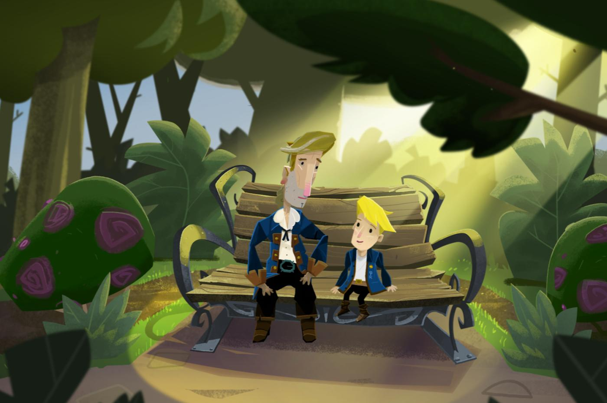
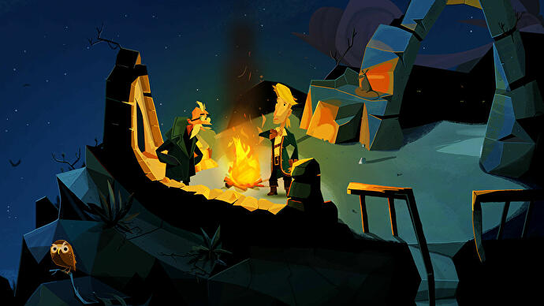
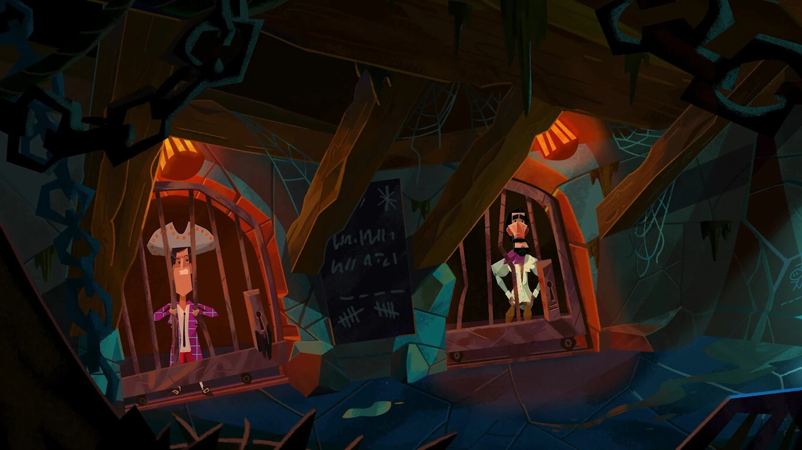

Cuando terminé la [anterior serie de posts](../2022-09-26-llegando-los-monos/) sobre aventuras gráficas, convergiendo al anuncio de *Return to Monkey Island*, no me proponía continuar con el tema. Me tomó varias semanas probar el juego<a id="fnr.1" class="footref" href="#fn.1" role="doc-backlink">1</a> y lo hice sin demasiadas expectativas; no tomé notas ni planeaba hacer una reseña pero después de varias sesiones me encontré con muchas cosas para decir, así que acá van.

(Puede contener spoilers).

El juego empieza con un preludio en el que controlamos al hijo de Guybryush y Eleaine, que cumple varios propósitos: darle cierta continuidad a aquel enigmático final de *Monkey Island 2*, servir de tutorial de la mecánica y los controles, y darle un marco narrativo a la nueva historia, que se va a desenvolver como un relato de Guybrush en un tono parecido al de *How I Met your mother*<a id="fnr.2" class="footref" href="#fn.2" role="doc-backlink">2</a>. El juego propiamente dicho empieza exactamente igual que *The Secret of Monkey Island*: hablando con el vigía de Mêlée™, y de hecho los primeros capítulos son el recorrido turístico de rigor<a id="fnr.3" class="footref" href="#fn.3" role="doc-backlink">3</a>, viendo en qué andan los personajes y cómo cambiaron los escenarios, rememorando los detalles de aquellas primeras aventuras. Y, cuando el tercer capítulo converge peligrosamente a una conclusión y pareciera que *Return to Monkey Island* se conforma con este  breve paseo nostálgico, el juego recomienza en un movimiento clásico de Ron Gilbert<a id="fnr.4" class="footref" href="#fn.4" role="doc-backlink">4</a>: el objetivo se complejiza, estalla en muchos puzzles paralelos, nos dan un mapa, un barco y nuevas islas para explorar.

Gilbert nunca fue el mejor ideando argumentos para sus juegos, y lo sabe; sus personajes son entrañables pero sencillos y, en el caso de *Return to Monkey Island*, se limitó mayormente a recuperar a los viejos conocidos. La trama, casi necesariamente, se parece a la de las ediciones anteriores, incluso a aquellas de las que el autor original no participó. Donde Ron Gilbert hace la diferencia es en la jugabilidad. Aún respetando la [rica historia del género](../2022-08-09-llegando-los-monos/), es justo decir que él inventó las aventuras gráficas como llegamos a conocerlas, y no hay nadie que pueda igualar su oficio para producirlas, nadie con semejante sensibilidad para construir la experiencia del jugador. Con poco alarde y una serie de pequeñísimas innovaciones, el juego triunfa donde todos los demás vienen fracasando hace dos décadas: *Return to Monkey Island* actualiza el género sin traicionar su esencia.

 

El primer aspecto donde se nota la atención al detalle es en la interfaz. Las descripciones de escenarios, objetos y personajes son abundantes, en muchos casos con varias líneas por objeto, y no bloquean el mouse ni detienen el movimiento de Guybrush. En lugar de la anacrónica lista de verbos y su sucesora, la "moneda" con íconos, el juego adopta el estándar contemporáneo limitado a los dos botones del mouse, y lo mejora: el significado del click es diferente para cada objeto y es anunciado con una leyenda en pantalla, recuperando así la sensación de variedad sin darle trabajo superfluo al jugador. Podemos saber si dos objetos funcionan juntos con solo arrastrar uno sobre el otro, evitando así el prueba y error y las clásicas respuestas genéricas del estilo "eso no funciona".

Todas estas elecciones de diseño contribuyen a minimizar la fricción, las interacciones innecesarias, las repeticiones e interrupciones, aumentando la inmersión: se invita al jugador a que interactúe constantemente con el entorno e intente todo lo que pueda, más para poder disfrutar del contenido (generalmente humorístico) que para obtener información o resolver un puzzle concreto. Con el mismo espíritu, el juego introduce algunas novedades de "gamificación": cartas de trivia escondidas en los escenarios (el primer uso legítimo del [*pixel-hunting*](https://en.wiktionary.org/wiki/pixel_hunting) a la fecha) y logros de Steam que efectivamente generan un meta-puzzle en el que el jugador trata de imaginar qué acciones rebuscadas podrían llegar a ser premiadas<a id="fnr.5" class="footref" href="#fn.5" role="doc-backlink">5</a>.

Más allá de la interfaz, hay una serie de elementos para ayudar a los aventureros novatos sin entorpecer la experiencia de los veteranos: dos niveles de dificultad<a id="fnr.6" class="footref" href="#fn.6" role="doc-backlink">6</a>, un "álbum de recuerdos" para recapitular los juegos anteriores, una *to-do list* con los objetivos inmediatos del juego, un libro de pistas, la opción de revisar los diálogos que tuvimos anteriormente y el clásico método de volver a preguntar directamente a los personajes. En resumidas cuentas, el juego entrega todas las herramientas para que cada jugador calibre la dificultad al nivel que prefiera y no tenga que salir a buscar respuestas a otro lado. En mi caso particular, los puzzles me resultaron siempre justos, suficientes para mantenerme entretenido pero sin bloquearme en ningún momento; algunos eran previsibles, otros los resolví con un poco deducción. Hubiera preferido un mayor desafío, pero sospecho que no había mucho espacio para aumentar la dificultad sin introducir injusticias o ridiculeces.

 

Hablemos del aspecto más polémico del juego, los gráficos, que generaron un rechazo inmediato (y exagerado) de un sector del público en cuanto empezaron a circular las primeras capturas. Lo primero que voy a decir es que objetivamente no se trata de gráficos *berreta*, como sí es el caso en la mayoría de los *remakes* de aventuras clásicas: las reediciones de los primeros *Monkey Island*, los *Full Throttle* y *Day of the Tentacle* que publicó Double Fine e incluso el original *Tales of Monkey Island* de Telltale dejan ver las costuras y la falta de presupuesto en cada rincón y quedan mal parados incluso frente a los píxeles noventosos. *Return of Monkey Island* tampoco sufre del mal de las aventuras indies, que se ven bien en las capturas pero son notablemente crudas en las animaciones. Para este juego la estética fue una elección creativa, original, y está bien lograda<a id="fnr.7" class="footref" href="#fn.7" role="doc-backlink">7</a>, con escenarios ricos en detalles y personajes vívidos. Mi gran problema es que ese estilo, coherente y pulido como es, me resulta desagradable. Y, aunque sea una cuestión subjetiva, era de esperarse la decepción de buena parte de los jugadores, privados de aquel arrobamiento que, a través de los años y las capacidades tecnológicas, sintieron por la mayoría de los clásicos de LucasArts<a id="fnr.8" class="footref" href="#fn.8" role="doc-backlink">8</a> y que era una parte fundamental de la experiencia. Dicho esto, los gráficos de ninguna manera arruinan lo que por lo demás es un gran juego. Y cabe preguntarse si siquiera es posible conseguir en 2022 una experiencia 2D satisfactoria con el presupuesto limitado de las aventuras gráficas.

 

Por último, respecto al final y a la anticipada revelación del Secreto de Monkey Island, solo voy a decir que

<i>[Inserte el disco 22]</i>  
<i>[Inserte el disco 36]</i>  
<i>[Inserte el disco 114]</i>  

Gilbert surfeó relativamente bien el problema de gestionar las expectativas desmesuradas y honrar el legado sin dedicarse exclusivamente a la nostalgia y al *fan service*. Incluso metabolizó ese dilema de creador en el argumento del juego, encarnando el deseo de los fanáticos en un Guybrush obsesionado con descubrir el Secreto de Monkey Island. Durante todos estos años, el verdadero secreto fue saber cómo sería una última entrega de la saga si le daban a su autor la posibilidad de dirigirla. Con la discutible salvedad del estilo visual, *Return to Monkey Island* es el mejor regreso y último acto que cabía esperar, tal y como *Thimbleweed Park* lo fue antes para las aventuras gráficas "hardcore". Y, así como algunos hinchas de Boca nos volvimos con los años hinchas de Juan Román Riquelme, los fanáticos de las aventuras gráficas somos hoy humildes coleccionistas de las artesanías de Ron Gilbert.

<section class="footnotes" markdown=1>
## Notas
<!--- 
# Notas al pie de p&aacute;gina

 -->
<a id="fn.1" href="#fnr.1">1</a> De hecho, me encontré con un [crash al comienzo del juego](https://steamcommunity.com/app/2060130/discussions/0/3361398061433376185/) que me hizo postergarlo todavá más.

<a id="fn.2" href="#fnr.2">2</a> Este formato de narración abre además la posibilidad de interrupciones humorísticas y da una excusa para repasar dónde nos habíamos quedado cuando cargamos el juego después de un par de días.

<a id="fn.3" href="#fnr.3">3</a> Con resultados mucho más satisfactorios que los de *Escape from Monkey Island*, aquella olvidable última aventura gráfica de LucasArts que volvía a unas versiones irreconocibles de Mêlée y Monkey Island.

<a id="fn.4" href="#fnr.4">4</a> Esta estructura de aventura es la que introdujo *Monkey Island 2* y se repitió en *The Curse of Monkey Island*, *Escape from Monkey Island*, y &#x2014;reemplazando las islas con el pueblo&#x2014; en *Thimbleweed Park*.

<a id="fn.5" href="#fnr.5">5</a> Por ejemplo: dejar que Guybrush muera asfixiado llevándolo al límite de su resistencia bajo el agua.

<a id="fn.6" href="#fnr.6">6</a> Lo que en  *Monkey 2* y *Monkey 3* podría haberse considerado como una indecisión respecto a la dificultad del juego, en este caso se vuelve una necesidad para satisfacer a dos grupos de público muy distintos.

<a id="fn.7" href="#fnr.7">7</a> Obviamente estamos a años luz de los dibujos animados del *Curse of Monkey Island*, pero ¿Qué le podemos pedir a un juego de nicho cuando ni siquiera el propio *Disney* apela a las animaciones artesanales para sus superproducciones?

<a id="fn.8" href="#fnr.8">8</a> Algo parecido se da con *Broken Age*, la otra aventura profesional contemporánea que no apeló a la nostalgia del Pixel Art. El estilo es original y acabado pero no termina de cautivar.

</section>
