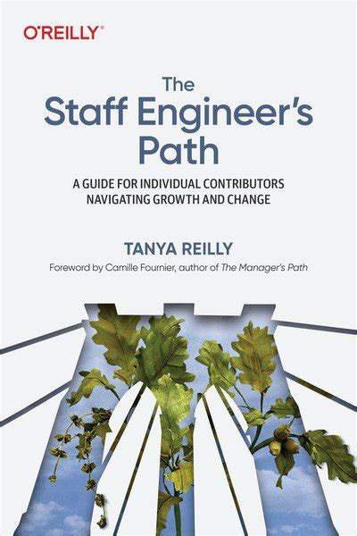
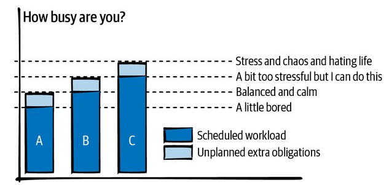
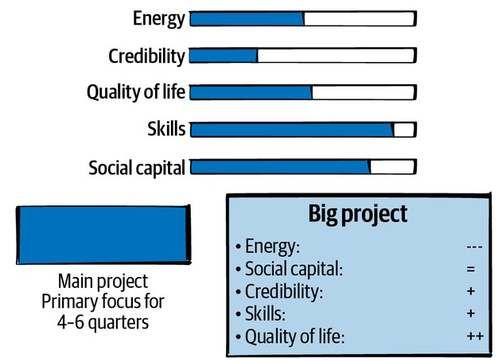

 

[*Peopleware*](https://www.goodreads.com/book/show/18895165-peopleware), uno de los libros clásicos de la industria del software, plantea así su premisa:

> The major problems of our work are not so much technological as sociological in nature. (&#x2026;) The researchers who made fundamental breakthroughs are in a high-tech business. The rest of us are appliers of their work. We use computers and other new technology components to develop our products or to organize our affairs. Because we go about this work in teams and projects and other tightly knit working groups, we are mostly in the human communication business. Our successes stem from good human interactions by all participants in the effort, and our failures stem from poor human interactions.
> 
> The main reason we tend to focus on the technical rather than the human side of the work is not because it's more crucial, but because it's easier to do.

Partiendo de una larga educación en "ciencias duras" y pasando los primeros años de nuestras carreras enterrados en absorber los detalles técnicos del trabajo, a algunos programadores nos lleva un tiempo asumir esta realidad.

Entiendo que los autores de *Peopleware* fueron pioneros en llamar la atención sobre los aspectos humanos de la profesión pero, aunque los principios que proponen siguen siendo válidos, el tratamiento quedó obsoleto. El libro dedica un simpática cantidad de espacio a explicar cómo evitar las interrupciones telefónicas o cómo distribuir los cubículos en la oficina. Es un libro pre-internet. Ese espacio lo ocupa en la bibliografía contemporánea [*The Manager's Path*](https://www.goodreads.com/book/show/33369254-the-manager-s-path), de Camille Fournier, que incorpora la evolución de la industria tecnológica durante las últimas décadas en una propuesta de  carrera de management: desde relacionarse con el propio manager, a gestionar equipos, gestionar otros managers y hasta organizaciones enteras. Una de las primeras etapas de ese camino es la de Tech Lead, el desarrollador experimentado que todavía contribuye individualmente, que no tiene la responsabilidad ni la autoridad para manejar gente pero sí ejerce influencia y liderazgo sobre los demás.

Existe el prejuicio de que, llegado a ese punto, el profesional de software tiene que tomar una decisión: o "salta" a la carrera de manager o se "queda" como ingeniero *senior*. No hay vergüenza en ninguna de las dos opciones, pero sí un aire de resignación: o sacrifico el trabajo técnico que me apasiona y que me trajo hasta donde estoy, o me conformo con el mismo puesto por el resto de mi carrera<a id="fnr.1" class="footref" href="#fn.1" role="doc-backlink">1</a>. Pero hay una *tercera posición*. Existe una bifurcación, un camino alternativo para crecer profesionalmente sin gestionar personas, que, en algunas organizaciones, incluye posiciones como *Staff*, *Principal* y *Distinguished Engineer* (agrupadas bajo el término *Staff+*).

 

El libro [*The Staff Engineer's Path*](https://www.goodreads.com/book/show/61058107-the-staff-engineer-s-path) de Tanya Reilly, que documenta ese camino menos conocido, es efectivamente el lado B del *Manager's Path*, la otra mitad del plan de carrera<a id="fnr.2" class="footref" href="#fn.2" role="doc-backlink">2</a>, <a id="fnr.3" class="footref" href="#fn.3" role="doc-backlink">3</a>.

## Notas

¿Qué hace exactamente un *Staff Engineer*? En buena medida depende de la organización y de la posición relativa dentro de esa organización. No es lo mismo hacerlo en una empresa que lo contempla en su plan de carrera que hacerlo *de facto* como Tech Lead de un equipo reducido. Will Larson, que entrevistó a varios Staff Engineers, [identifica cuatro *arquetipos*](https://staffeng.com/guides/staff-archetypes):

-   El **Tech Lead**, que guía el enfoque y la ejecución de un equipo en particular, generalmente a la par de un manager.
-   El **Arquitecto**, que suele dirigir y garantizar la calidad de un área de la organización, posiblemente asistiendo pero sin formar parte de ningún equipo.
-   El **Solucionador**, que salta de problema en problema, profundizando para destrabar situaciones complejas y allanarle el camino a los equipos que lo sucedan.
-   La **Mano Derecha**, que en organizaciones grandes trabaja directamente para algún ejecutivo, aumenta su alcance y le da perspectiva técnica.

Cada uno es un enfoque distinto, una posible "implementación" de la idea de escalar la influencia y multiplicar el impacto del líder técnico. Cuál o cuáles adopte una persona particular depende de sus inclinaciones y de la estructura y la cultura de la organización en la que se desempeña. Pero en todos los casos sigue valiendo la premisa de *Peopleware*; progresar como líderes técnicos implica mejorar como comunicadores, elegir cuidadosamente cómo usar el tiempo, delegar y empoderar a los demás para abordar problemas de más grandes. Aunque no requiera manejo directo de personas, el Staff Engineer pasa más tiempo en reuniones, más tiempo "surfeando la política", menos programando. De nuevo: no es necesariamente un rol atractivo para cualquiera, y no tiene nada malo optar por dedicarse a la tecnología y maximizar el tiempo de código.

&lowast; &lowast; &lowast;

Yonatan Zunger [identifica cuatro disciplinas](https://leaddev.com/sites/default/files/2021-09/Role%20and%20Influence%20The%20IC%20Trajectory%20Beyond%20Staff.pdf) en los equipos profesionales:

-   La **habilidad técnica básica** de un puesto, por ejemplo: programación, diseño UI/UX, etc.
-   La **gestión de producto**: determinar *qué* hay que hacer y *por qué*, y elaborar una narrativa al respecto.
-   La **gestión de proyecto**: ocuparse de los aspectos prácticos para lograr los objetivos, darle seguimiento a las tareas, eliminar bloqueos.
-   La **gestión de personas**: convertir grupos de personas en equipos, ayudarlos a crecer profesionalmente y manejar conflictos.

Cada una es una disciplina distinta y la mayoría de los proyectos requiere de las cuatro, independientemente de quién la ejecute. Me parece interesante distinguirlas porque alguien las termina ejecutando en la práctica, aunque sea implícitamente<a id="fnr.4" class="footref" href="#fn.4" role="doc-backlink">4</a>. Si no hay alguien ocupando un puesto dedicado (por ejemplo un *Project Manager* o un *Product Owner*), es probable que la responsabilidad recaiga en el Staff Engineer de turno.

&lowast; &lowast; &lowast;

El libro se divide en tres partes, por cada uno de los tres "pilares" de los roles Staff+: mirada global (*big-picture thinking*), ejecución de proyectos (*project execution*) y subir el nivel de los ingenieros con los que trabajamos (*leveling up*). De la primera parte, me interesó la propuesta de *evitar los máximos locales*.

El trabajo de desarrollo de software es una larga sucesión de decisiones, constantemente tenemos que optar entre alternativas mediante un análisis de *tradeoffs*, de costos y beneficios. Con la experiencia aprendemos a evitar la arbitrariedad e ignorar nuestras preferencias personales en esas decisiones, las calibramos según los objetivos de equipo. El problema que señala Reilly es que, concentrados en el día a día de nuestro equipo, nos falta el contexto necesario para medir el impacto que nuestras decisiones tienen en el resto de la organización. Optimizamos para el máximo local, una solución ideal para nuestro equipo que no necesariamente es la mejor para el conjunto de la organización. El planteo me interesó porque aplica un razonamiento que ya había visto en otros contextos:

-   Hablando del [manejo de la complejidad en el diseño de sistemas](../2022-11-28-posdata-sobre-la-complejidad-esencial/), John Ousterhout nos advierte sobre la práctica común de dividir módulos para hacerlos más simples individualmente, al costo de aumentar la complejidad total del sistema. Un caso parecido es el de simplificar la implementación de un componente al costo de complejizar su interfaz.
-   En su ensayo [Choose Boring Technology](https://mcfunley.com/choose-boring-technology), citado en el libro, Dan McKinley habla del peligro de "elegir la herramienta correcta para cada trabajo" con este ejemplo: si el lenguaje ideal para un nuevo sistema es Python pero el resto de los sistemas de la organización están implementados en Ruby, la complejidad de tener que manejar un lenguaje nuevo supera el beneficio local de la elección "ideal".

&lowast; &lowast; &lowast;

Quizás el capítulo más jugoso es el que trata cómo administrar el tiempo de trabajo. Se da por sentado que a medida que se sube en la "escalera técnica", aumenta la autonomía del ingeniero y es al menos parcialmente responsable de elegir en qué proyectos invertir su tiempo. El libro ataca el problema desde distintos ángulos.

Por empezar, tenemos qué identificar cuán ocupados nos gusta estar. ¿Preferimos estar siempre al máximo de nuestra capacidad y fundirnos cuando surjan emergencias o cambios de prioridades? ¿Preferimos reservar margen de maniobra con el riesgo de aburrirnos un poco mientras tanto?

 

Hay que asumir que en una organización saludable, siempre va a haber más trabajo disponible del que un Staff Engineer puede atacar. De todo el universo de posibles proyectos que podrían aprovechar nuestra atención, ¿cuál es el que más vale la pena, el que maximiza nuestro aporte? Hunter Walk ([citado por Larson](https://staffeng.com/guides/work-on-what-matters)) propone esta clasificación para orientarnos:

 

-   Proyectos de **alto impacto/bajo esfuerzo**: son la elección obvia, pero también los primeros que desaparecen a medida que crece la organización.
-   Proyectos de **alto impacto/alto esfuerzo**: donde idealmente deberíamos pasar la mayor parte de nuestro tiempo, y entre los que tendremos que priorizar con algún otro criterio.
-   Proyectos de **bajo impacto/alto esfuerzo**: los que uno supone que nunca deberían realizarse pero que, si no vigilamos con honestidad, aparecen y absorben energía.
-   Proyectos de **bajo impacto/bajo esfuerzo**: lo que Walk llama *snacking* (porque llenan pero no alimentan). Siempre es tentador atacar proyectos fáciles de completar, y puede ser útil elegirlos de vez en cuando para subir la moral o recuperar la energía, pero si es lo único que hacemos estamos perdiendo el tiempo.

Así como tenemos que considerar el costo/beneficio para la organización, tenemos que ser honestos al gestionar los recursos que tenemos como individuos. Para ilustrar esta idea, Reilly hace una analogía con el juego *The Sims<a id="fnr.5" class="footref" href="#fn.5" role="doc-backlink">5</a>*: propone que cada profesional dispone, además de su tiempo, de una serie de recursos (energía, credibilidad, calidad de vida, habilidades, capital social) que se consumen o se recargan según el trabajo que hacemos. Cada proyecto tiene un efecto sobre esos recursos que tenemos que tomar en consideración al elegirlo<a id="fnr.6" class="footref" href="#fn.6" role="doc-backlink">6</a>:

 

Si el último proyecto nos dejó exhaustos, lo mejor para nosotros y para la organización es tomarnos vacaciones antes de encarar otro proyecto demandante; si sentimos que nos estamos quedando atrás en habilidades tal vez sea mejor priorizar proyectos con oportunidades de aprendizaje, etc.

## Conclusión

Más allá de que el título de Staff Engineer sea raro fuera de un grupo de organizaciones medianas o grandes, lo interesante del libro de Tanya Reilly es que muestra un camino de crecimiento desde el liderazgo técnico y nos invita a razonar sobre la dinámica del trabajo en equipo y la influencia organizacional a escalas mayores de las que estamos acostumbrados. Nos recuerda, como antes *Peopleware* y como *The Manager's Path*, que estamos en el negocio de la comunicación y de las interacciones humanas, que los "soft skills" no son territorio exclusivo de los PMs. Por eso, me parecen lecturas valiosas para cualquier profesional del software, independientemente de su posición o de su proyecto de carrera.

## Referencias

Muchas de las ideas y técnicas que discute el libro (y que son difíciles de resumir acá) surgen de otros autores, y uno de los aportes más valiosos de Tanya Reilly es su [curaduría de artículos y charlas](https://noidea.dog/staff-resources). Listo acá los que me gustaron.

-   Charity Majors, The Engineer/Manager Pendulum:
    -   [The Engineer/Manager Pendulum](https://charity.wtf/2017/05/11/the-engineer-manager-pendulum/)
    -   [Engineering Management: The Pendulum Or The Ladder](https://charity.wtf/2019/01/04/engineering-management-the-pendulum-or-the-ladder/)
-   Will Larson, [Staff archetypes](https://staffeng.com/guides/staff-archetypes).
-   Joy Ebertz, [Should Staff+ Engineers Be Writing Code?](https://jkebertz.medium.com/should-staff-engineers-be-writing-code-1237abf891f4)
-   Hillel Wayne, The Crossover Project:
    -   [Are we really engineers?](https://www.hillelwayne.com/post/are-we-really-engineers/)
    -   [We are not special](https://www.hillelwayne.com/post/we-are-not-special/).
    -   [What engineering can teach (and learn from) us](https://www.hillelwayne.com/post/what-we-can-learn/).
-   Evan Smith, [Kind Engineering: How To Engineer Kindness](https://kind.engineering/).
-   Tanya Reilly, [Being Glue](https://noidea.dog/glue).
-   Ryan Harter, [Getting credit for invisible work at the Staff+ level](https://leaddev.com/staffplus/getting-credit-invisible-work-staff-level).
-   Will Larson, [A forty-year career](https://lethain.com/forty-year-career/).
-   Camille Fournier, [An incomplete list of skills senior engineers need, beyond coding](https://skamille.medium.com/an-incomplete-list-of-skills-senior-engineers-need-beyond-coding-8ed4a521b29f).
-   John Allspaw, [On Being A Senior Engineer](https://www.kitchensoap.com/2012/10/25/on-being-a-senior-engineer/).
-   Elizabeth Ayer, [Don’t ask forgiveness, radiate intent](https://medium.com/@ElizAyer/dont-ask-forgiveness-radiate-intent-d36fd22393a3).
-   Will Larson, [Work on what matters](https://staffeng.com/guides/work-on-what-matters).
-   Cindy Sridharan, [Technical Decision Making](https://copyconstruct.medium.com/technical-decision-making-9b2817c18da4).
-   Dan McKinley, [Choose Boring Technology](https://mcfunley.com/choose-boring-technology).
-   Will Larson, [How to invest in technical infrastructure](https://lethain.com/how-to-invest-technical-infrastructure/).
-   Will Larson, [Manage technical quality](https://staffeng.com/guides/manage-technical-quality).

<section class="footnotes" markdown=1>
## Notas
<!--- 
# Notas al pie de p&aacute;gina

 -->
<a id="fn.1" href="#fnr.1">1</a> En el peor de los casos, esta disyuntiva empuja a gente valiosa a dedicarse al management, una disciplina distinta y para la que quizás no tenga interés o aptitud, dañándose a sí mismo y a las personas que termina manejando.

<a id="fn.2" href="#fnr.2">2</a> Este libro no es el primer esfuerzo en documentar el rol de Staff Engineer. En su sitio [staffeng.com](https://staffeng.com/), Will Larson reúne guías y entrevistas a profesionales que lo ejercen. *The Staff Engineer's Path* lo cita en varias oportunidades, así que, entre este libro y una selección de las guías, el material queda bastante bien cubierto.

<a id="fn.3" href="#fnr.3">3</a> El rol de Staff Engineer se superpone un poco con lo que tradicionalmente, sobre todo en los ambientes "enterprise", se entiende por Arquitecto de Software. Esta visión está cubierta por el libro *Foundations of Software Architecture*, que [comenté en otro post](../2020-09-15-tldr-fundamentals-of-software-architecture/), y la secuela de los mismos autores, *Software Architecture: The Hard Parts*.

<a id="fn.4" href="#fnr.4">4</a> Otra razón por la que me gusta esta clasificación es que separa la gestión de personas de la gestión de proyectos. La gestión de proyectos me parece una aptitud técnica accesible para un ingeniero con experiencia, mientras que la gestión de personas es un mundo aparte. Todos nos cruzamos con esa criatura mitológica, lo que Camille Fournier llama el *Zar de los Procesos* que, contrario a lo que pedía el [Manifiesto Agile](https://agilemanifesto.org/), desestima a los individuos y sobredimensiona la importancia de seguir un proceso específico a rajatabla. Se trata del revés exacto de la caricatura del programador cuadrado que cree que lo único que importa es el código.

<a id="fn.5" href="#fnr.5">5</a> La autora expone una versión temprana de esta analogía [en su blog](https://noidea.dog/blog/how-many-vacation-days-does-it-take-to-change-a-lightbulb).

<a id="fn.6" href="#fnr.6">6</a> La idea no es elegir exclusivamente los proyectos según las necesidades individuales de las personas sino tenerlas siempre presentes, no hacer de cuenta que esas necesidades no existen o no importan.

</section>
